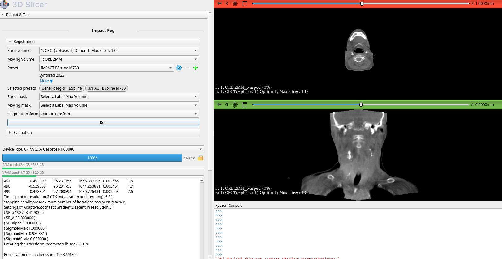
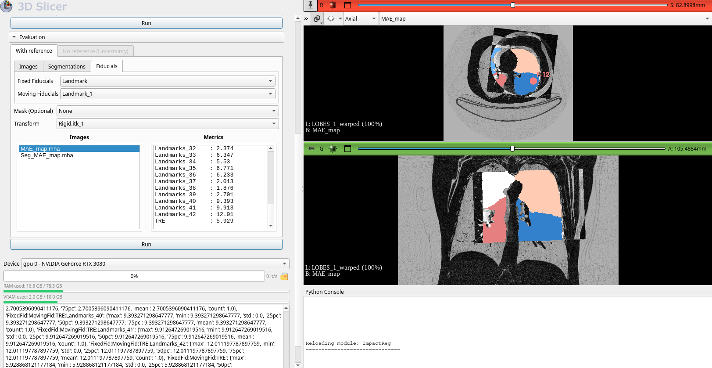

# 🔄 Slicer IMPACT-Reg

**Slicer IMPACT-Reg** is an open-source 3D Slicer extension dedicated to **multimodal medical image registration**.  
It integrates the **IMPACT similarity metric [1]** within the **Elastix** registration engine, bringing state-of-the-art deep semantic alignment directly into Slicer.

Powered by **KonfAI [2]**, the module provides the following features:

- Fully automated registration pipelines  
- GPU-accelerated feature extraction  
- Built-in quality assessment and visualization  
- Ensemble-based uncertainty quantification  

All within a clinically-friendly environment.

---

## 🖼️ User Interface

| IMPACT-Reg registration workflow | Registration evaluation panel |
|---------------------------------|-------------------------------|
|   | |
| *Figure 1 – Multimodal registration interface.* | *Figure 2 – Evaluation with reference labels.* |

---

## ✅ What you can do in 3 minutes (step-by-step tutorial)

This quick tutorial demonstrates the typical clinical workflow: **load → run registration → review results → assess reliability**.

### 1) Install and open the module
1. Install **3D Slicer ≥ 5.10**
2. Open **3D Slicer** and go to **Extension Manager**
3. Search for **ImpactReg**
4. Click **Install**
5. Restart Slicer and open the **ImpactReg** module from the **Registration** category

### 2) Load a case
1. In Slicer, click **DICOM** (or drag-and-drop a NIfTI / NRRD / MHA file)
2. Load the two volumes: the fixed and the moving image (e.g., `Fixed.nii.gz`, `Moving.nii.gz`)
3. Confirm the volumes appears in the **Data** module and is visible in the slice views

### 3) Run inference
1. On ImpactReg module go to the **Registration** tab
2. Select:
   - **Fixed volume** and **Moving volume** 
   - **Preset**: choose one or more presets (e.g., Generic Rigid + BSpline or IMPACT CT/MR).
        - To add a preset, select it from the combo box.
        - To remove a preset, click on it in the list of selected presets.
3. Click **Run**
4. Wait for completion: once the process finishes, the warped moving volume is automatically overlaid with the fixed volume in the slice views

✅ You can now inspect the results in 2D and 3D and adjust visualization (opacity).

### 4) QA with reference (optional)

If a reference annotation (ground truth) is available, it can be:
- an image (e.g., a registered reference volume),
- a segmentation on the fixed and/or moving images,
- or paired landmarks defined in both volumes.

1. Load the reference data (image, segmentation, or landmarks).
2. Go to the **Evaluation** tab.
3. Select:
   - **Images** tab for image-based evaluation,  
   - **Segmentations** tab for segmentation-based evaluation,  
   - **Fiducials** tab for landmark-based evaluation.
4. Provide:
   - Fixed and moving ground-truth data,
   - Optional **ROI mask**,
   - The resulting **transform** file.
5. Click **Run**.
6. Review quantitative metrics and qualitative overlays directly inside Slicer.

Generated outputs include:

- **MAE_map**: voxel-wise Mean Absolute Error (MAE) map between the fixed and warped moving volumes.
- **Seg_MAE_map**: segmentation-based error map, measuring region-wise discrepancies between corresponding structures.

Reported metrics:

- **MAE**  
- **Dice**  
- **TRE**

### 5) QA without reference (uncertainty estimation)

When no ground-truth annotation is available, you can still assess registration reliability.

1. Go to the **Evaluation** tab and select **No reference (Uncertainty)**.
2. Select:
   - The **Transform sequence** generated during registration,
   - A **reference image** defining the transform domain.
3. Click **Run**.
4. Review the generated uncertainty outputs:
   - Uncertainty maps.

Uncertainty can be estimated using:
- Multi-preset ensembling.

---

## ✨ Features

### 🧠 Deep semantic registration
- IMPACT: feature-space similarity from pretrained segmentation networks  
- Multi-preset execution enabling sequential refinement  
- GPU or CPU execution  
- Optional mask-constrained registration  

### 📊 Built-in evaluation and QA
- Landmark, segmentation, and intensity-based metrics  
- Automatic warped volume generation  
- 2D/3D synchronized visualization inside Slicer  

### 🔁 Ensemble-based robustness
- Multiple registration presets executed sequentially  
- Composite deformation field estimation  
- Average transform computation  

### 📉 Uncertainty quantification
- Analysis of the statistical variability of transforms  
- Automatic visualization of uncertainty volumes  
- JSON metrics export for downstream analysis
- 
---

## 🧩 Presets & Models

Parameter maps and pretrained models are automatically downloaded from:  
📦 **VBoussot/ImpactReg** on Hugging Face Hub  

Each preset includes:
- Parameter maps for Elastix  
- Feature extractor models for IMPACT  
- A volume-dependent preprocessing function  

---

## 📚 References

1. **Boussot, V. et al.**  
   *IMPACT: A Generic Semantic Loss for Multimodal Medical Image Registration.*  
   arXiv:2503.24121 — 2025  

2. **Boussot, V. & Dillenseger, J-L.**  
   *KonfAI: A Modular and Fully Configurable Framework for Deep Learning in Medical Imaging.*  
   arXiv:2508.09823 — 2025  

