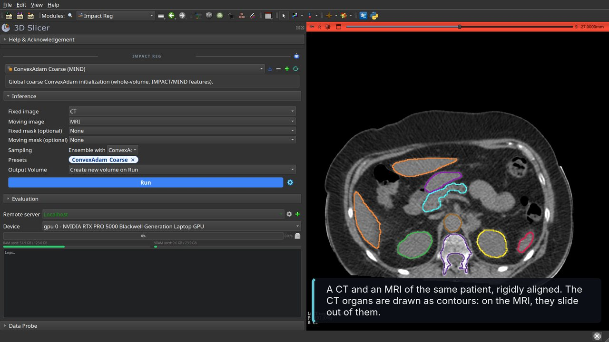
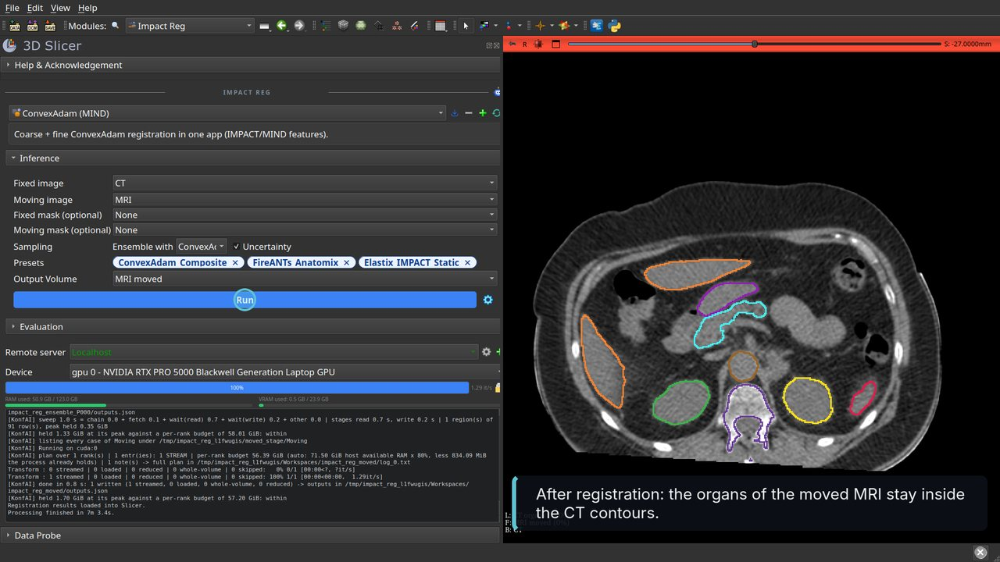
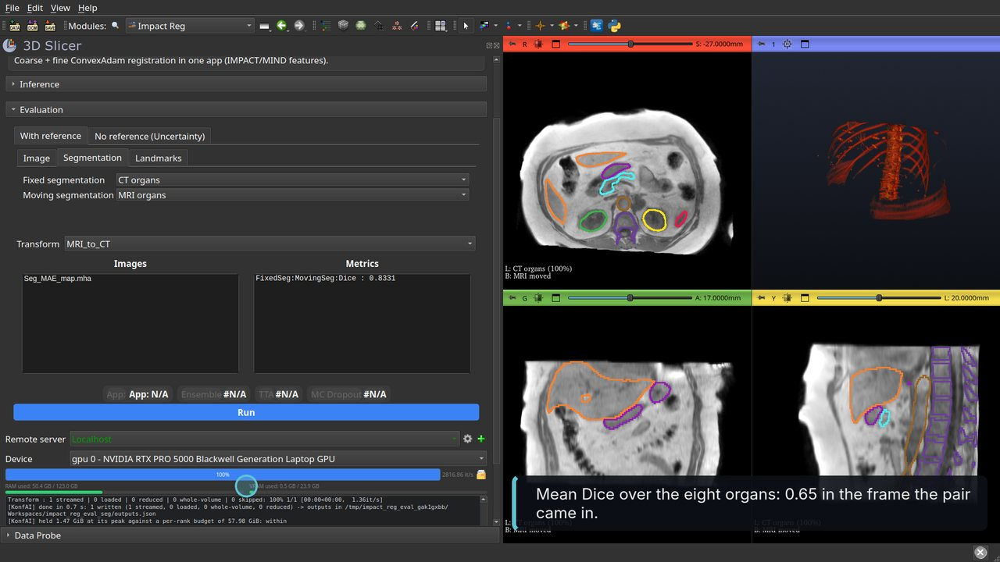
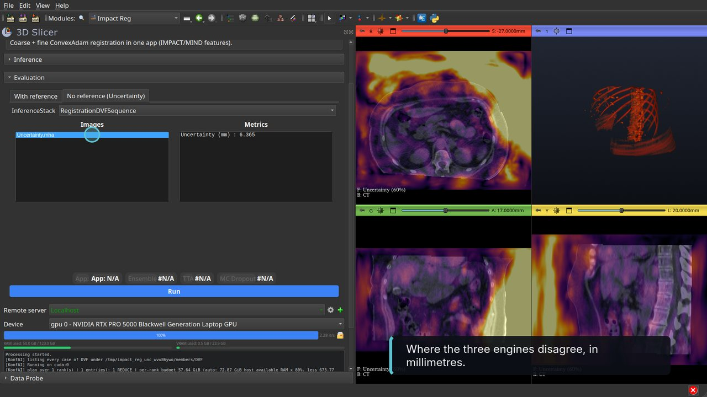

# 🔄 IMPACT-Reg: Multimodal Image Registration in 3D Slicer

[](https://github.com/vboussot/SlicerImpactReg/blob/main/LICENSE)
[](https://huggingface.co/VBoussot/ImpactReg)
[](https://pypi.org/project/impact-reg-konfai/)
[](https://github.com/vboussot/SlicerImpactReg)
[](https://arxiv.org/abs/2503.24121)


**IMPACT-Reg** is a 3D Slicer extension for **multimodal image registration**: an MRI, a CT or a CBCT of the same patient brought into one frame. The alignment is driven by the **IMPACT** similarity metric, which compares the images through the features of pretrained segmentation and foundation models (TotalSegmentator, MIND, anatomix) rather than through their intensities, so that pairs of different modalities align on anatomy. Its **registration presets** run three engines, **elastix**, **ConvexAdam** and **FireANTs**, with or without IMPACT. Presets can be ensembled, the result is evaluated against a reference image, reference segmentations or paired landmarks, and its uncertainty is estimated from the spread of the ensemble when no reference exists. Everything is powered by **KonfAI**.

<br>

📚 Reference

> 🔗 IMPACT: A Generic Semantic Loss for Multimodal Medical Image Registration
> Valentin Boussot, Cédric Hémon, Jean-Claude Nunes, Jason Dowling, Simon Rouzé, Caroline Lafond, Anaïs Barateau, Jean-Louis Dillenseger
> [arXiv:2503.24121](https://arxiv.org/abs/2503.24121)

---

## 🌐 The ecosystem

- **[SlicerImpactReg](https://github.com/vboussot/SlicerImpactReg)** (this repo): the Slicer interface for registration, evaluation and uncertainty.
- **[ImpactReg presets](https://huggingface.co/VBoussot/ImpactReg)**: the registration apps on Hugging Face, each with its parameter maps or configuration and the feature models it uses.
- **[impact-reg-konfai](https://pypi.org/project/impact-reg-konfai/)**: the command line the extension drives (`register`, `eval`, `uncertainty`), built on [KonfAI](https://github.com/fideus-labs/KonfAI).
- **[ImpactLoss](https://github.com/vboussot/ImpactLoss)**, **[ITKIMPACT](https://github.com/InsightSoftwareConsortium/ITKIMPACT)** and **[ImpactElastix](https://github.com/vboussot/ImpactElastix)**: the IMPACT metric as a PyTorch loss, as an ITK module (`itk-impact`, which runs the ConvexAdam presets) and as an elastix build.
- **[Feature models](https://huggingface.co/VBoussot/impact-torchscript-models)**: the TorchScript extractors (TotalSegmentator, MIND, anatomix) the presets download on first use.
- **[SlicerKonfAI](https://github.com/vboussot/SlicerKonfAI)**: the generic KonfAI extension this one is built on (app list, panels, process manager, device row).
- **[SlicerImpactSynth](https://github.com/vboussot/SlicerImpactSynth)**: synthetic CT from MRI and CBCT; IMPACT-Reg aligned its training pairs and aligns an sCT with its reference CT before evaluation.

---

## 🎥 Demonstration Video

<!-- Drop Screenshots/SlicerImpactReg-tutorial.mp4 into the README editor on GitHub and paste the user-attachments URL it gives here: GitHub then embeds a player. -->

**[Watch the walkthrough](Screenshots/SlicerImpactReg-tutorial.mp4)** (with captions), recorded on an abdomen MRI/CT pair of the public SynthRAD2025 dataset, rigidly aligned by the challenge, with the organs moved between the two scans. Three deformable presets, one per engine and all driven by IMPACT, are ensembled; the organs segmented on each image and their centroids serve as reference segmentations and paired landmarks.
👉 Step by step with screenshots: [`TUTORIAL.md`](TUTORIAL.md)

| Before registration | After registration |
|---------------------|--------------------|
|  |  |
| *The CT organs as contours over the MRI: the organs slide out of them.* | *The moved MRI: the organs stay inside the CT contours.* |

| Evaluation with segmentations | Uncertainty without reference |
|-------------------------------|-------------------------------|
|  |  |
| *Dice of the organs segmented on each image, after warping.* | *Where the three engines disagree, in millimetres.* |

---

## ✨ Key Features

- **Presets on three engines**
  elastix (rigid, rigid + B-spline, IMPACT in Static and in Jacobian mode), ConvexAdam through `itk-impact` (coarse initialisation, coarse + fine, on MIND alone or with TotalSegmentator layers), FireANTs on the GPU (SyN, SyN driven by IMPACT, the anatomix pipeline). Downloaded from Hugging Face on first use, each with its parameter maps or configuration and the feature models it needs.

- **The IMPACT metric**
  The similarity is measured between deep features of the two images instead of their intensities: TotalSegmentator layers, MIND descriptors, anatomix features. In **Static** mode the features are extracted once and registered as feature volumes; in **Jacobian** mode the loss is differentiated through the network on patches sized to the receptive field.

- **Fixed, moving, optional masks**
  Pick the fixed and the moving image in the scene (DICOM, NIfTI, NRRD, MHA), and a fixed or a moving mask to restrict the metric region. Click Run.

- **Ensembles**
  Add presets with *Ensemble with*: all of them run and their displacement fields are averaged into one transform. Tick *Uncertainty* to keep each field for the QA without reference.

- **Results in the scene**
  The moved image is loaded as a new volume over the fixed one, and the transform as a transform node that applies to any other node (segmentations, markups) through the Transforms module.

- **Evaluation with references**
  *Image*: the moving image is warped with the transform and compared with a reference image in the fixed frame, MAE inside an optional mask and its map. *Segmentation*: Dice between the fixed segmentation and the warped moving one, and a map of where they disagree. *Landmarks*: target registration error on paired fiducials.

- **Uncertainty without reference**
  After an ensemble run, the spread of the per-preset displacement fields gives a voxel-wise uncertainty map in millimetres, and its mean as a metric.

- **Advanced settings**
  The gear next to Run lists the parameters each preset exposes (iterations, grid spacing, learning rate and so on). Changed values are forwarded to the engine, and *Save as local app* keeps them as a new preset.

- **Local GPU or CPU**
  The registration runs in a separate process on the selected device; the RAM and VRAM gauges follow it. Remote servers are not used for registration yet.

---

## 🧩 Presets

| Preset in Slicer | App | Pair | Engine | What it does |
|------------------|-----|------|--------|--------------|
| Generic Rigid | `Generic_Rigid` | any | elastix | Rigid alignment, mutual information, multi-resolution |
| Generic Rigid + BSpline | `Generic_Rigid_BSpline` | any | elastix | Rigid, then B-spline deformable refinement |
| elastix + IMPACT (Static), TotalSegmentator M730 | `Elastix_IMPACT_Static` | MRI / CT | elastix + IMPACT | B-spline driven by a deep TotalSegmentator layer and MIND, features extracted once on the whole image |
| elastix + IMPACT (Jacobian), TotalSegmentator M730 | `Elastix_IMPACT_Jacobian` | CT / CBCT | elastix + IMPACT | B-spline driven by early TotalSegmentator layers, differentiated through the network |
| ConvexAdam Coarse (MIND) | `ConvexAdam_Coarse` | any | itk-impact | Linear pre-alignment, then the global coarse coupled-convex initialisation on MIND features |
| ConvexAdam (MIND) | `ConvexAdam_Composite` | any | itk-impact | The same coarse pass followed by the Adam instance-optimisation refinement |
| ConvexAdam, MIND + TotalSegmentator MR early layer | `ConvexAdam_IMPACT_CBCT` | CT / CBCT | itk-impact + IMPACT | ConvexAdam (MIND) with the second layer of TotalSegmentator MR added |
| ConvexAdam, MIND + TotalSegmentator MR segmentation | `ConvexAdam_IMPACT_MRCT` | MRI / CT | itk-impact + IMPACT | ConvexAdam's coarse search on MIND and the segmentation head of TotalSegmentator MR |
| FireANTs (SyN) | `FireANTs_SyN` | any | FireANTs | Rigid, affine, then SyN diffeomorphic registration on the GPU |
| FireANTs (IMPACT) | `FireANTs_IMPACT` | CT / CBCT | FireANTs + IMPACT | Rigid, affine, then SyN driven by IMPACT on early TotalSegmentator layers |
| FireANTs SyN, TotalSegmentator MR decoder + MIND | `FireANTs_IMPACT_MRCT` | MRI / CT | FireANTs + IMPACT | FireANTs (SyN) driven by the last decoder layer of TotalSegmentator MR and MIND, features extracted once |
| FireANTs SyN, anatomix + MIND features | `FireANTs_Anatomix` | any | FireANTs + IMPACT | The anatomix pipeline: anatomix and MIND features extracted once and registered as feature volumes |

The FireANTs presets install `fireants` on first use and need a GPU; FireANTs is distributed under its own license, shipped in each preset's `NOTICE`. The elastix + IMPACT presets download the elastix-IMPACT binary built for the CUDA of the installed PyTorch.

---

## 🧭 Which preset?

| 🧪 Scenario | 🔧 Preset | 💡 Rationale |
|-------------|-----------|--------------|
| **MRI to CT** | **ConvexAdam (MIND)** or **FireANTs SyN, anatomix + MIND features** | The best overlap on the walkthrough case. ConvexAdam takes under a minute and starts from any position. |
| **MRI to CT, rigidly aligned** (planning workflows, challenge pairs) | **elastix + IMPACT (Static)** | The MR/CT configuration of the IMPACT study: a deep TotalSegmentator layer and MIND, features extracted once. A B-spline without a rigid stage: start from an aligned pair. |
| **CT to CBCT**, adaptive radiotherapy | **elastix + IMPACT (Jacobian)** | The CT/CBCT configuration of the IMPACT study: early TotalSegmentator layers differentiated through the network, where texture carries the alignment. Several minutes per pair. |
| **Same modality**, follow-up CT or MRI | **Generic Rigid + BSpline** or **FireANTs (SyN)** | Intensity metrics are enough when the contrast is the same. |
| **An initial alignment** before another preset | **Generic Rigid**, or **ConvexAdam Coarse** for a coarse deformable one | Then select the moved image as the moving image of a second run, for example with an elastix + IMPACT preset. |
| **Uncertainty**, any pair | two or more deformable presets, *Uncertainty* ticked | The disagreement between engines maps where the result should be checked. Ensemble presets of the same kind: a rigid result averaged with deformable ones measures nothing. |

---

## 📊 On the walkthrough case

Abdomen MRI/CT pair 1ABA005 of SynthRAD2025 (CT 465 × 367 × 91 voxels of 1 × 1 × 3 mm), rigidly aligned by the challenge. Dice is the mean over eight organs segmented by MRSegmentator on each image; the landmarks are the centroids of the same organs. Time is the wall time of `impact-reg-konfai register` on an RTX PRO 5000 laptop GPU (24 GB), feature models already downloaded.

| MRI to CT | Time | Dice | TRE (mm) |
|-----------|-----:|-----:|---------:|
| *As aligned by the challenge* | | 0.65 | 11.2 |
| ConvexAdam (MIND) | 47 s | 0.83 | 5.3 |
| FireANTs SyN, anatomix + MIND features | 4 min 42 s | 0.83 | 5.6 |
| FireANTs (SyN) | 1 min 18 s | 0.82 | 6.4 |
| Generic Rigid + BSpline | 22 s | 0.81 | 6.5 |
| elastix + IMPACT (Static) | 2 min 8 s | 0.77 | 9.2 |
| **Ensemble** of ConvexAdam, anatomix and elastix + IMPACT, as in the video | 7 min 3 s | **0.83** | **6.1** |

One case: validate the presets on your own data before drawing conclusions from this table.

---

## 🚀 Quick Start in Slicer

1. Install **3D Slicer ≥ 5.10**, then from the **Extensions Manager** the **PyTorch** extension (SlicerPyTorch) and **ImpactReg**. The **KonfAI** extension is installed with it.
2. Restart Slicer and open **Impact Reg** (category **Registration**). On the first opening, `impact-reg-konfai` is installed into Slicer's Python with the matching `konfai` and `konfai-apps`. The elastix-IMPACT binary, `itk-impact`, `fireants` and the feature models are downloaded the first time a preset needs them.
3. Load the two images (**DICOM** module, or drag and drop NIfTI / NRRD / MHA files).
4. In **Inference**, choose the preset, the **fixed image** and the **moving image** (and masks if you have them), add presets with **Ensemble with**, tick **Uncertainty** if you will need the QA without reference, click **Run**. The moved image is overlaid on the fixed image and the transform is selected in the evaluation panel.
5. Open **Evaluation**:
   - **With reference**, tab **Image**: a reference image in the fixed frame, the moving image, an optional mask, **Run**: the MAE inside the mask, and `MAE_map` in the image list.
   - Tab **Segmentation**: the fixed and the moving label maps, **Run**: the mean Dice over the labels, and `Seg_MAE_map` in the image list.
   - Tab **Landmarks**: the fixed and the moving fiducial lists, **Run**: the mean target registration error.
   - **No reference (Uncertainty)**: the displacement fields of the ensemble are preselected, **Run**: the `Uncertainty` map.
6. The transform node moves any other node of the scene: select it in the **Transforms** module, or harden it on the moving image.

👉 Every step with a screenshot: [`TUTORIAL.md`](TUTORIAL.md)

---

## ⚙️ From the command line

The same presets run outside Slicer:

```bash
pip install impact-reg-konfai
impact-reg-konfai register ConvexAdam_Composite FireANTs_Anatomix Elastix_IMPACT_Static -f ct.mha -m mr.mha -o Output --gpu 0 --uncertainty
impact-reg-konfai eval --preset Elastix_IMPACT_Static --transform Output/P000/Transform.h5 -f mr_reference.mha -m mr.mha --mask body.mha -o Evaluation --gpu 0
impact-reg-konfai eval --preset Elastix_IMPACT_Static --transform Output/P000/Transform.h5 --gt-fixed-fid ct.fcsv --gt-moving-fid mr.fcsv -o Evaluation --gpu 0
impact-reg-konfai uncertainty --preset Elastix_IMPACT_Static --dvf Output/P000/Ensemble/*.h5 -o Uncertainty --gpu 0
```

or with the generic runner, one preset at a time:

```bash
konfai-apps infer VBoussot/ImpactReg:ConvexAdam_Composite -i ct.mha -i mr.mha -o Output --gpu 0
```

`register` writes the moved image, the transform (`Transform.h5`) and, with `--uncertainty`, one transform per preset under `Ensemble/`. Give the presets the **raw images**; masks are optional and restrict the metric.

---

## 🧩 What the extension is made of

The module registers one app template, **Registration**, for the apps of `VBoussot/ImpactReg` on the `KonfAI` facade of the KonfAI extension (API version 2). Two panels are subclassed: the inference panel drives `impact-reg-konfai register` and turns the checkpoint chips into a preset selector, the QA panel drives `impact-reg-konfai eval` and `impact-reg-konfai uncertainty` and exports the raw nodes, since the CLI warps the moving data itself. The app list, the process manager, the log, the device row and the gauges come from [SlicerKonfAI](https://github.com/vboussot/SlicerKonfAI).

Run from source:

```bash
Slicer --additional-module-paths /path/to/SlicerKonfAI/KonfAI /path/to/SlicerImpactReg/ImpactReg
```

---

## 📚 References

1. Boussot, V., Hémon, C., Nunes, J.-C., Dowling, J., Rouzé, S., Lafond, C., Barateau, A., Dillenseger, J.-L., **IMPACT: A Generic Semantic Loss for Multimodal Medical Image Registration.** *arXiv:2503.24121*, 2025.
2. Boussot, V. & Dillenseger, J.-L., **KonfAI: A Modular and Fully Configurable Framework for Deep Learning in Medical Imaging.** *arXiv:2508.09823*, 2025.
3. Boussot, V., Hémon, C., Nunes, J.-C., Dillenseger, J.-L., **Why Registration Quality Matters: Enhancing sCT Synthesis with IMPACT-Based Registration.** *arXiv:2510.21358*, 2025.
4. Klein, S., Staring, M., Murphy, K., Viergever, M. A., Pluim, J. P. W., **elastix: a toolbox for intensity-based medical image registration.** *IEEE Trans. Med. Imaging*, 29(1), 2010.
5. Siebert, H., Großbröhmer, C., Hansen, L., Heinrich, M. P., **ConvexAdam: Self-Configuring Dual-Optimisation-Based 3D Multitask Medical Image Registration.** *IEEE Trans. Med. Imaging*, 2024.
6. Jena, R., Chaudhari, P., Gee, J. C., **FireANTs: Adaptive Riemannian Optimization for Multi-Scale Diffeomorphic Registration.** *Nature Communications*, 2024.
7. Dey, N. *et al.*, **Learning General-Purpose Biomedical Volume Representations using Randomized Synthesis** (anatomix). *arXiv:2411.02372*, 2024.
8. Heinrich, M. P. *et al.*, **MIND: Modality independent neighbourhood descriptor for multi-modal deformable registration.** *Med. Image Anal.*, 16(7), 2012.
9. Wasserthal, J. *et al.*, **TotalSegmentator: Robust Segmentation of 104 Anatomic Structures in CT Images.** *Radiology: Artificial Intelligence*, 5(5), 2023.
10. Thummerer, A. *et al.*, **SynthRAD2025 Grand Challenge dataset: Generating synthetic CTs for radiotherapy from head to abdomen.** *Med. Phys.*, 52(7), 2025.
