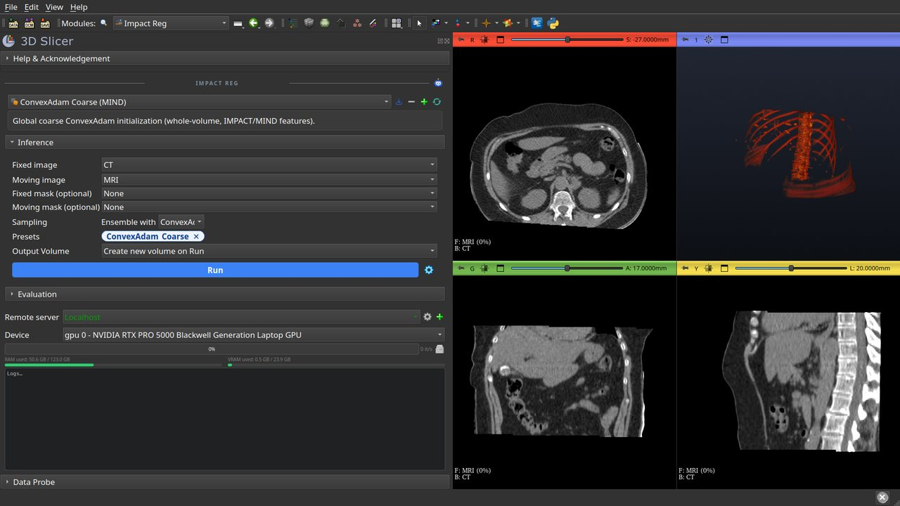
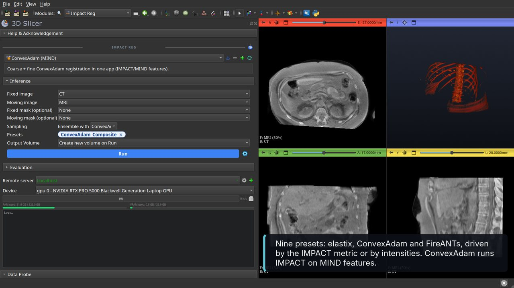
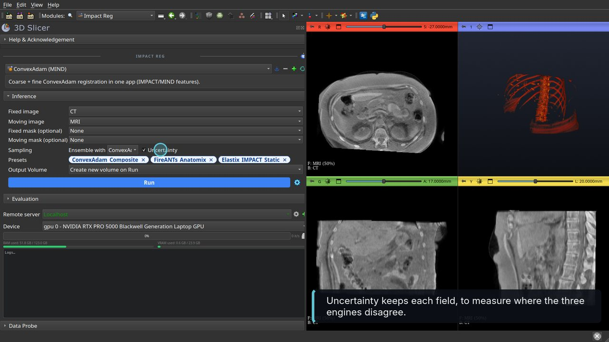
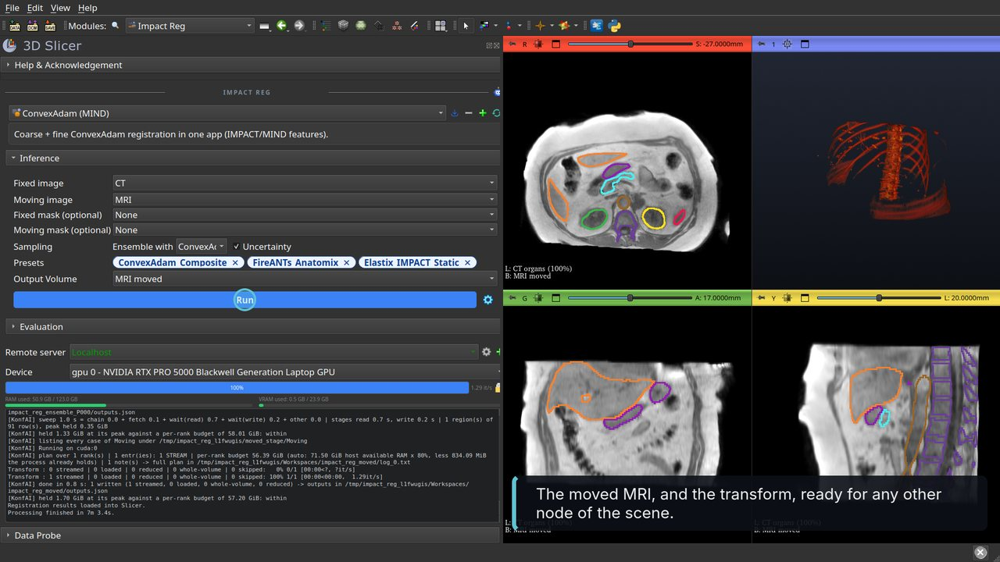
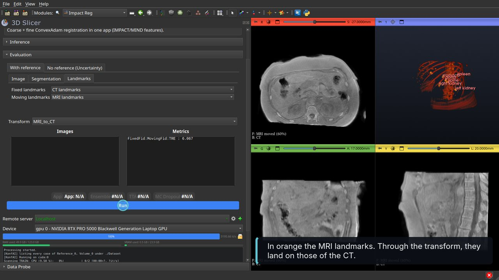
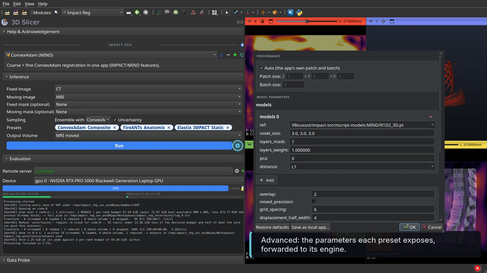

# Walkthrough

Video with captions: [SlicerImpactReg-tutorial.mp4](Screenshots/SlicerImpactReg-tutorial.mp4).

Recorded on case 1ABA005 of the public [SynthRAD2025](https://synthrad2025.grand-challenge.org/)
dataset (Task 1, abdomen): an MRI and a CT of the same patient, 465 × 367 × 91 voxels of
1 × 1 × 3 mm, rigidly aligned by the challenge. Between the two scans the organs moved: the
kidneys, the liver and the spleen sit several millimetres away from where the CT has them. The
references are the organs segmented by MRSegmentator on each image (spleen, kidneys, liver,
stomach, pancreas, aorta, spine) and, as paired landmarks, the centroid of each of these organs
in the CT segmentation and in the MRI segmentation. Recorded on an RTX PRO 5000 laptop GPU
(24 GB); the waits are played faster in the video. A DICOM series loaded through the DICOM
module works the same way.

1. **Install** the extension and open **Impact Reg** (category *Registration*). On the first
   opening the module installs `impact-reg-konfai` into Slicer's Python, with the matching
   `konfai` and `konfai-apps`; PyTorch comes from the SlicerPyTorch extension. Load the CT and
   the MRI (drag and drop, or *Add Data*).

   

2. **Look at the pair.** In the axial view, with the CT organs drawn as contours (a label map
   shown as outline), fade from the CT to the MRI: on the MRI the kidneys, the liver and the
   spleen slide out of their CT contours. The pair is rigidly aligned; what is left to recover
   is the motion of the organs, a deformable registration.

   

3. **Choose the preset.** The app list holds the presets of `VBoussot/ImpactReg`: elastix,
   ConvexAdam and FireANTs engines, driven by the IMPACT metric or by intensities. *ConvexAdam
   (MIND)* runs the ConvexAdam coarse and fine passes on MIND features through `itk-impact`. The
   card under the list describes it. **Fixed image** is the CT, **Moving image** the MRI (the
   panel picks two distinct volumes by itself); the masks are optional and restrict the metric
   region.

   

4. **Ensemble and uncertainty.** **Ensemble with** adds further presets, here *FireANTs SyN,
   anatomix + MIND features* and *elastix + IMPACT (Static)*: one deformable preset per engine,
   all three driven by IMPACT. The **Presets** row shows the three chips; all will run and their
   displacement fields will be averaged into one transform. **TTA** is the number of flipped
   registrations each preset averages. **Uncertainty** keeps the displacement field of each preset
   for the evaluation without reference. Ensemble presets of the same kind: averaging a rigid
   result with deformable ones measures nothing.

   

5. **Run.** The two images are written to a temporary folder and `impact-reg-konfai register`
   runs in a separate process, one preset after the other. The log shows their output, the
   progress bar follows them, and the RAM and VRAM gauges show the memory of the selected device.
   Each preset downloads what it needs on its first run (`itk-impact`, `fireants`, the
   elastix-IMPACT binary, the feature models). About seven minutes on this card for the three
   presets. The moved MRI is loaded as a new volume; faded against the CT again, its organs now
   stay inside the CT contours.

   

6. **The result in the scene.** The moved MRI (`MRI_moved`) and the transform (`MRI_to_CT`) are
   in the scene; the transform is selected in the evaluation panel, ready for the Transforms
   module or for any other node.

   

7. **Evaluate with segmentations.** Open *Evaluation*, tab *With reference*, sub-tab
   *Segmentation*: the fixed segmentation (the CT organs) and the moving segmentation (the MRI
   organs), as label maps. Run: the moving labels are warped with the transform and the *Metrics*
   list gives the mean Dice over the labels: 0.83, against 0.65 in the frame the pair came in.

   

8. **Evaluate with landmarks.** Sub-tab *Landmarks*: two fiducial lists, the points in the fixed
   image and the same points in the moving image. Run: the mean target registration error over the
   pairs, in millimetres: 6.1, against 11.2 before the registration. Put the moving landmarks
   under the transform (Transforms module, *Apply transform*) and they land on the fixed ones: in
   the video, the orange MRI landmarks join the CT landmarks in the 3D view.

   

9. **Estimate uncertainty without reference.** Tab *No reference (Uncertainty)*: the displacement
   fields kept at step 5 are preselected (the `RegistrationDVFSequence` node). Run: the spread of
   the three fields, voxel by voxel, gives the `Uncertainty` map in millimetres and its mean as a
   metric. Where the engines disagree is where the result deserves a look. Outside the body, where
   there is nothing to align, each engine extrapolates its own way and the spread is large.

   

10. **Advanced settings.** The gear next to Run opens the *Advanced* dialog: the parameters the
    main preset exposes (iterations, grid spacing, learning rate and so on, depending on the
    engine). Changed values are forwarded to the preset, and *Save as local app* keeps them as a
    new preset in the list.

    

The *Image* sub-tab of the evaluation is not in the video: it compares the warped moving image
with a reference image acquired in the fixed frame (a follow-up scan of the same modality, or a
synthetic CT against its planning CT), which this case does not have.

From the command line, the same run is:

```bash
impact-reg-konfai register ConvexAdam_Composite FireANTs_Anatomix Elastix_IMPACT_Static -f CT.mha -m MRI.mha -o Output --gpu 0 --uncertainty
impact-reg-konfai eval --preset ConvexAdam_Composite --transform Output/P000/Transform.h5 --gt-fixed-seg CT_organs.nii.gz --gt-moving-seg MRI_organs.nii.gz -o Evaluation --gpu 0
impact-reg-konfai eval --preset ConvexAdam_Composite --transform Output/P000/Transform.h5 --gt-fixed-fid CT_landmarks.fcsv --gt-moving-fid MRI_landmarks.fcsv -o Evaluation --gpu 0
impact-reg-konfai uncertainty --preset ConvexAdam_Composite --dvf Output/P000/Ensemble/*.h5 -o Uncertainty --gpu 0
```
